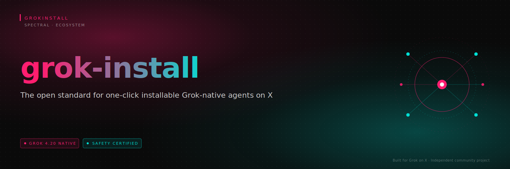
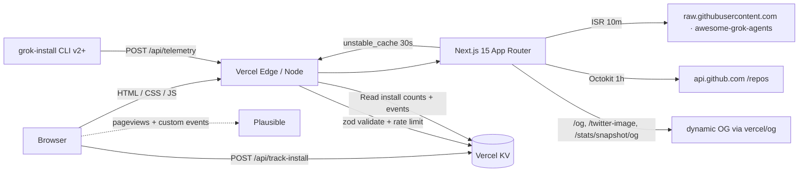

<!-- SPECTRAL VISUAL IDENTITY · TIER 4 · GROK-AGENTS-MARKETPLACE -->

<p align="center">
  
</p>

<h1 align="center">⚡ grok-agents-marketplace</h1>

<p align="center">
  <b>The public-facing marketplace at <a href="https://grokagents.dev">grokagents.dev</a>.</b><br/>
  Discover, compare, and install Grok-native agents with a single click-to-tweet on X.
</p>

<p align="center">
  
</p>

<p align="center">
  <a href="https://grokagents.dev"></a>
  
  
  
  
  <a href="./LICENSE"></a>
</p>

<p align="center">
  <a href="https://grokagents.dev">
    
  </a>
</p>

---

## ✦ What Ships Here

**Thirteen routes** on the live surface at [grokagents.dev](https://grokagents.dev) — nine user-facing page groups plus five dynamically rendered OG / Twitter images, with `sitemap.xml` and `robots.txt` auto-generated from the catalog.

<table>
  <tr>
    <td width="33%">
      <h3>🏠 Landing</h3>
      <p><code>/</code> — marketplace preview, section teasers, featured agents.</p>
    </td>
    <td width="33%">
      <h3>🛒 Marketplace</h3>
      <p><code>/marketplace</code> — searchable, filterable grid of every certified agent.</p>
    </td>
    <td width="33%">
      <h3>📄 Per-Agent Pages</h3>
      <p><code>/marketplace/[id]</code> — YAML manifest, demo, install tabs, one-click <b>Install on X</b>.</p>
    </td>
  </tr>
  <tr>
    <td>
      <h3>📂 Curated Sections</h3>
      <p><code>/marketplace/sections/{trending,voice,swarm,new,beginner}</code></p>
    </td>
    <td>
      <h3>🏆 Hall of Fame</h3>
      <p><code>/hall-of-fame</code> — top-10 by live install count.</p>
    </td>
    <td>
      <h3>✏️ Submit</h3>
      <p><code>/submit</code> — client-side form that generates a pre-filled PR on <code>awesome-grok-agents</code>.</p>
    </td>
  </tr>
  <tr>
    <td>
      <h3>📊 Stats Dashboard</h3>
      <p><code>/stats</code> — live counters, growth charts, Pro vs Standard, category breakdown, day×hour heatmap, CSV export.</p>
    </td>
    <td>
      <h3>🔎 Per-Agent Deep Dive</h3>
      <p><code>/stats/agents/[id]</code> — install volume, referrers, search queries.</p>
    </td>
    <td>
      <h3>🔐 Privacy</h3>
      <p><code>/privacy</code> — what we collect, don't, how to opt out, 90-day retention pledge.</p>
    </td>
  </tr>
</table>

## ✦ What's New — Spectral (Tier 4)

<table>
  <tr>
    <td width="50%">
      <h3>🌌 Spectral palette</h3>
      <p>Plasma <code>#FF1E70</code> + Aurora <code>#00E0D5</code> on <code>#0A0A0A</code>. New <code>NebulaBackdrop</code> drifts soft Plasma + Aurora circles behind every hero strip; <code>spectral-divider</code> hairlines transition between sections.</p>
    </td>
    <td width="50%">
      <h3>✨ Chromatic-aberration headline</h3>
      <p>The hero "Grok-native" word picks up a Plasma + Aurora text-shadow split, paired with a subtle halftone dot grid for that risograph print feel.</p>
    </td>
  </tr>
  <tr>
    <td>
      <h3>🔤 Inter as the display face</h3>
      <p>Inter is now both body and display; JetBrains Mono drives eyebrows and code. Space Grotesk demoted to legacy fallback only.</p>
    </td>
    <td>
      <h3>🎨 Token-clean rollout</h3>
      <p>All Spectral colors flow through <code>tailwind.config.ts</code> + <code>src/app/globals.css</code>. <b>Zero</b> hardcoded hex in components. The schema in <code>parse-visuals.ts</code> now accepts <code>plasma</code> + <code>aurora</code> alongside the legacy accents.</p>
    </td>
  </tr>
</table>

## ✦ What's New in v2.14

<table>
  <tr>
    <td width="50%">
      <h3>🎨 Visuals Renderer</h3>
      <p>Agents ship a <code>visuals</code> block in their manifest → drives a dedicated Preview Card on <code>/marketplace/[id]</code>. Three style variants (<code>futuristic</code>, <code>premium</code>, <code>minimal</code>), two accent tokens (<code>cyan</code>, <code>green</code>), media dispatcher (gif/video/image) with auto-generated SVG placeholder fallback. Source: <code>src/components/AgentPreviewCard/</code>.</p>
    </td>
    <td width="50%">
      <h3>🛡️ Zod-Validated Schema</h3>
      <p>Every <code>visuals</code> block runs through <code>parseVisuals()</code> before render. Invalid or hex-coded accents are silently dropped — the page falls back to the classic demo iframe, so a malformed manifest never breaks a detail page. 15 vitest cases in <code>src/lib/visuals/__tests__/</code>.</p>
    </td>
  </tr>
  <tr>
    <td>
      <h3>📡 visuals_block_rendered Event</h3>
      <p>Cookieless Plausible custom event fires on each preview-card mount with <code>{ agent_id, accent_color, style }</code>. Fully documented on <a href="./src/app/privacy/page.tsx"><code>/privacy</code></a>.</p>
    </td>
    <td>
      <h3>✨ Adoption Counter on /stats</h3>
      <p>New Sparkle card tracks how many catalogued agents have opted into the Visuals Renderer.</p>
    </td>
  </tr>
  <tr>
    <td colspan="2">
      <h3>🎯 Brand-Token Discipline</h3>
      <p>The new component surface introduces <b>zero</b> hardcoded hex values — every color, glow, and border flows from existing tokens in <code>tailwind.config.ts</code>.</p>
    </td>
  </tr>
</table>

## ✦ Architecture



## ✦ Stack

<p align="center">
  
  
  
  
  
  
</p>
<p align="center">
  
  
  
  
  
  
  
</p>

<details>
<summary><b>Full stack detail</b></summary>

- **Next.js 15** App Router · React Server Components · Turbopack dev
- **TypeScript** strict, `noUncheckedIndexedAccess` on
- **Tailwind CSS** with locked GrokInstall brand tokens
- **Recharts** for every chart on `/stats` and `/stats/agents/[id]`
- **SWR** for client-side polling of live counters and growth series
- **Zod** for telemetry payload + `visuals` block validation at boundaries
- **Octokit** for live GitHub star counts (authenticated when `GITHUB_TOKEN` set)
- **Shiki** for YAML syntax highlighting on agent detail pages
- **@vercel/kv** for install-count persistence (falls back to in-memory in dev)
- **Plausible** privacy-first analytics, opt-in via env var
- **next-themes** for the dark/cyan theme provider
- **Biome** for lint + format (no ESLint/Prettier)
- **Vitest** for the Zod-parser suite (`npm run test`)

</details>

## ✦ Local Dev

```bash
npm install

# (optional) configure env
cp .env.example .env.local
# edit .env.local:
#   GITHUB_TOKEN=ghp_...          (raises rate limit; no scopes)
#   KV_REST_API_URL=...           (leave blank for in-memory fallback)
#   NEXT_PUBLIC_PLAUSIBLE_DOMAIN= (leave blank to disable analytics)
#   PLAUSIBLE_API_KEY=...         (server-side Stats API; referrers + search)

npm run dev
# → http://localhost:3000
```

### Commands

| Command | Purpose |
|---|---|
| `npm run dev` | Next.js dev server on :3000 |
| `npm run build` | Production build (prerenders all agents) |
| `npm run start` | Serve the production build |
| `npm run typecheck` | `tsc --noEmit` |
| `npm run lint` | `biome check .` |
| `npm run format` | `biome format --write .` |
| `npm run test` | `vitest run` (Zod parser suite) |
| `npm run test:watch` | `vitest` in watch mode |

## ✦ Deploy (Vercel)

<table>
  <tr>
    <td width="50%">
      <h3>1️⃣ Import</h3>
      <p>Import the repo in Vercel → new project, Next.js preset.</p>
    </td>
    <td width="50%">
      <h3>2️⃣ Storage</h3>
      <p>Create KV database, attach to project (exposes <code>KV_REST_API_URL</code> + <code>KV_REST_API_TOKEN</code>).</p>
    </td>
  </tr>
  <tr>
    <td>
      <h3>3️⃣ Env Vars</h3>
      <p>Production + Preview. See full list below.</p>
    </td>
    <td>
      <h3>4️⃣ Domain</h3>
      <p>Add <code>grokagents.dev</code> and <code>www.grokagents.dev</code>, set apex as primary.</p>
    </td>
  </tr>
</table>

### Environment variables

- `GITHUB_TOKEN` — no scopes needed
- `NEXT_PUBLIC_SITE_URL=https://grokagents.dev`
- `NEXT_PUBLIC_PLAUSIBLE_DOMAIN=grokagents.dev`
- `NEXT_PUBLIC_PLAUSIBLE_HOST` — optional (self-hosted Plausible)
- `PLAUSIBLE_API_KEY` — optional; enables the Stats API pulls on `/stats/agents/[id]` (top referrers + search queries). Omit to show "Plausible off" placeholders.
- KV vars get injected by the integration in step 2

**Deployments run multi-region** — `iad1`, `fra1`, `sin1` (see `vercel.json`).

### DNS records

| Host | Type | Value |
|---|---|---|
| `@` | A | `76.76.21.21` |
| `www` | CNAME | `cname.vercel-dns.com` |

Then flip to HTTPS-everywhere in the domain settings.

## ✦ CI

| Workflow | Job |
|---|---|
| [`.github/workflows/ci.yml`](./.github/workflows/ci.yml) | typecheck · biome check · vitest · `next build` |
| [`.github/workflows/dependency-review.yml`](./.github/workflows/dependency-review.yml) | fail-on-moderate, GPL/AGPL denylist |
| [`.github/workflows/lighthouse.yml`](./.github/workflows/lighthouse.yml) | Lighthouse on the Vercel preview, comment scores |

## ✦ Data Sources

<table>
  <tr>
    <td width="50%">
      <h3>📋 Catalog</h3>
      <p><code>raw.githubusercontent.com/.../featured-agents.json</code>, revalidated every 10m. Falls back to <code>src/data/featured-agents.mock.json</code> on fetch failure — dev works offline.</p>
    </td>
    <td width="50%">
      <h3>📈 Trending</h3>
      <p><code>trending.json</code> (optional). When absent, <code>/marketplace/sections/trending</code> sorts by live install counts.</p>
    </td>
  </tr>
  <tr>
    <td>
      <h3>⭐ Stars</h3>
      <p>GitHub REST via Octokit · 1-hour in-memory cache · stale-on-error.</p>
    </td>
    <td>
      <h3>🔢 Install Counts</h3>
      <p>Vercel KV — <code>install:total:&lt;id&gt;</code> + ZSET <code>install:recent:&lt;id&gt;</code> for 7-day windows. In-memory fallback in dev.</p>
    </td>
  </tr>
  <tr>
    <td>
      <h3>📡 Telemetry</h3>
      <p>Vercel KV sorted set <code>telemetry:events</code> · 90-day retention · Postgres port staged at <a href="./migrations/001_telemetry.sql"><code>migrations/001_telemetry.sql</code></a>.</p>
    </td>
    <td>
      <h3>🚦 Rate Limiting</h3>
      <p>Per-<code>anon_install_id</code> on <code>/api/telemetry</code> and per-IP on <code>/api/stats/public</code> — both 30 req/min with <code>Retry-After</code> headers.</p>
    </td>
  </tr>
</table>

## ✦ API

| Route | Method | Purpose |
|---|---|---|
| `/api/agents` | GET | Catalog + merged install counts (60s SWR cache) |
| `/api/track-install` | POST | Marketplace button clicks: `{ agent_id, source }` → increments counts. `source ∈ {marketplace, vscode, cli, x-intent, copy}` |
| `/api/track-install-intent` | POST | X-intent variant (post to X without redirecting) |
| `/api/telemetry` | POST | CLI telemetry — zod-validated, per-`anon_install_id` rate-limited, returns 204 |
| `/api/stats/public` | GET | Public aggregate JSON (IP rate-limited, CORS-enabled, 30s SWR) |
| `/api/stats/summary` | GET | Agent-level install summary, used by dashboard |
| `/api/stats/daily/[agentId]` | GET | 30-day per-agent daily series (zero-filled, 5-min cache) |
| `/api/stats/growth?period=&metric=` | GET | Aggregate growth series (installs/posts/savings × 7d/30d/90d) |

Cookie-based endpoints (`/api/track-install*`) set a first-party `gi_anon` HttpOnly cookie for anonymous de-duplication (1-year). The CLI telemetry path uses a locally-generated, rotatable `anon_install_id` instead — see `/privacy`.

### CLI telemetry payload

```json
{
  "event": "deploy",
  "timestamp": "2026-04-19T08:15:02.341Z",
  "cli_version": "2.0.4",
  "agent_category": "voice",
  "used_pro_mode": true,
  "used_swarm": false,
  "used_voice": true,
  "safety_score": 97,
  "agent_count": 1,
  "success": true,
  "anon_install_id": "k3r9s1-abc-0af4..."
}
```

The receive endpoint is CORS-open and rate-limited to **30 events/minute per `anon_install_id`** — excess requests return `429 { error: "rate_limited" }` with `Retry-After`. Events persist in Vercel KV (or in-memory in dev) for 90 days; aggregated counters on `/stats` live indefinitely.

## ✦ Submitting an Agent

Head to [`/submit`](https://grokagents.dev/submit), fill in the form, click **Open pre-filled PR** — you'll land on GitHub with the PR body pre-populated against `awesome-grok-agents`. Or copy the markdown body and open a PR manually.

## ✦ Brand System — Spectral (Tier 4)

All colors, radii, shadows, blur, and fonts live in `tailwind.config.ts` and `src/app/globals.css` — nowhere else. **No hardcoded hex in components.**

The Spectral palette layers Plasma + Aurora over a deep `#0A0A0A` field, with halftone dot patterns, drifting nebula circles, and subtle chromatic aberration on hero typography. Inter is now the display face; JetBrains Mono drives eyebrows and code.

| Token | Value | Role |
|---|---|---|
| `bg` | `#0A0A0A` | Deep field |
| `plasma` | `#FF1E70` | Primary brand accent · CTAs · hero |
| `aurora` | `#00E0D5` | Secondary accent · eyebrows · nav hover |
| `cyan` | `#00F0FF` | Legacy data accent (charts, vscode badge) |
| `green` | `#00FF9D` | Safety / success states |
| `danger` | `#FF2D55` | Warning only |
| `surface` | `rgba(255,255,255,0.04)` | Glass panels |
| `border-subtle` | `rgba(255,255,255,0.08)` | Hairlines |
| `border-focus` | `rgba(255,30,112,0.45)` | Focus rings |
| `shadow-plasmaGlow` | `0 0 28px rgba(255,30,112,0.35)` | Primary CTA glow |
| `shadow-auroraGlow` | `0 0 28px rgba(0,224,213,0.35)` | Secondary CTA glow |
| `shadow-spectral` | `0 0 36px plasma + 0 0 60px aurora` | Hero card |
| `backdrop-blur-gi` | `20px` | Glass blur |

### Spectral utilities (`src/app/globals.css`)

- `.bg-nebula` — layered Plasma + Aurora radial circles for hero strips
- `.bg-halftone`, `.bg-halftone-plasma`, `.bg-halftone-aurora` — 1px dots on a 14px grid
- `.text-glow-plasma`, `.text-glow-aurora` — outer glow on type
- `.chromatic-aberration` — Plasma + Aurora 1px text-shadow split for the hero word
- `.spectral-divider` — gradient hairline Plasma → Aurora
- `.text-spectral` — Plasma → Aurora gradient text fill

## ✦ Sibling Repos

<table>
  <tr>
    <td width="33%">
      <h3>📦 grok-install</h3>
      <p>The universal spec this marketplace showcases.</p>
      <a href="https://github.com/agentmindcloud/grok-install">Repository →</a>
    </td>
    <td width="33%">
      <h3>🌟 awesome-grok-agents</h3>
      <p>The catalog this site reads from on every deploy.</p>
      <a href="https://github.com/agentmindcloud/awesome-grok-agents">Repository →</a>
    </td>
    <td width="33%">
      <h3>🤖 grok-install-action</h3>
      <p>The GitHub Action that validates every submitted agent.</p>
      <a href="https://github.com/agentmindcloud/grok-install-action">Repository →</a>
    </td>
  </tr>
</table>

## ✦ Connect

<p align="center">
  <a href="https://grokagents.dev"></a>
  <a href="https://github.com/agentmindcloud"></a>
  <a href="https://x.com/JanSol0s"></a>
</p>

## ✦ Disclaimer

GrokInstall is an independent community project. **Not affiliated with xAI, Grok, or X.**

## ✦ License

Apache 2.0 — see [LICENSE](./LICENSE).

<p align="center">
  
</p>
