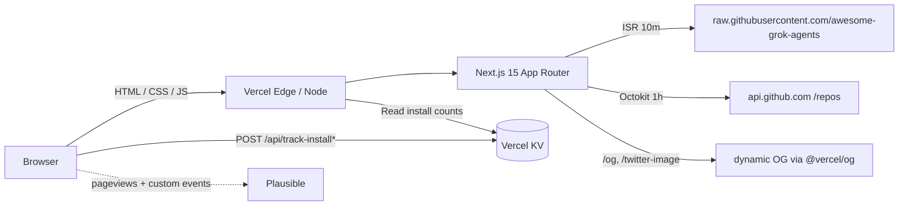

<div align="center">

# GROKINSTALL · Agents Marketplace

### The community marketplace for Grok-native agents on X

<p>
  
  
  
  
  
</p>

**Live:** https://grokagents.dev

</div>

---

`grok-agents-marketplace` is the public-facing marketplace at **grokagents.dev**
— where anyone can discover, compare, and install Grok-native agents with a
single click-to-tweet on X. Part of the GrokInstall ecosystem alongside
`grok-install`, `grok-yaml-standards`, `vscode-grok-yaml`, and
`grok-install-action`.

## What ships here

- `/` — landing with the marketplace, section teasers, and featured agents
- `/marketplace` — searchable, filterable grid of every certified agent
- `/marketplace/[id]` — per-agent page with YAML manifest, demo, install tabs,
  and the one-click **Install on X** button
- `/marketplace/sections/{trending,voice,swarm,new,beginner}` — curated cuts
- `/hall-of-fame` — top-10 by live install count
- `/submit` — client-side form that generates a pre-filled PR on
  `awesome-grok-agents`

## Architecture



## Stack

- **Next.js 15** App Router · React Server Components · Turbopack dev
- **TypeScript** strict, `noUncheckedIndexedAccess` on
- **Tailwind CSS** with locked GrokInstall brand tokens
- **Octokit** for live GitHub star counts (authenticated when `GITHUB_TOKEN` set)
- **Shiki** for YAML syntax highlighting on agent detail pages
- **@vercel/kv** for install-count persistence (falls back to in-memory in dev)
- **Plausible** privacy-first analytics, opt-in via env var
- **Biome** for lint + format (no ESLint/Prettier)

## Local dev

```bash
npm install

# (optional) configure env
cp .env.example .env.local
# edit .env.local:
#   GITHUB_TOKEN=ghp_...          (raises rate limit; no scopes)
#   KV_REST_API_URL=...           (leave blank for in-memory fallback)
#   NEXT_PUBLIC_PLAUSIBLE_DOMAIN= (leave blank to disable analytics)

npm run dev
# → http://localhost:3000
```

Commands:

| command             | purpose                                  |
| ------------------- | ---------------------------------------- |
| `npm run dev`       | Next.js dev server on :3000              |
| `npm run build`     | Production build (prerenders all agents) |
| `npm run start`     | Serve the production build               |
| `npm run typecheck` | `tsc --noEmit`                           |
| `npm run lint`      | `biome check .`                          |
| `npm run format`    | `biome format --write .`                 |

## Deploy (Vercel)

1. Import the repo in Vercel → new project, Next.js preset.
2. **Storage** → Create KV database, attach to the project (exposes `KV_REST_API_URL` + `KV_REST_API_TOKEN`).
3. **Environment Variables** (both Production + Preview):
   - `GITHUB_TOKEN` — no scopes needed
   - `NEXT_PUBLIC_SITE_URL=https://grokagents.dev`
   - `NEXT_PUBLIC_PLAUSIBLE_DOMAIN=grokagents.dev`
   - `NEXT_PUBLIC_PLAUSIBLE_HOST` — optional (self-hosted Plausible)
   - KV vars get injected by the integration in step 2
4. **Domain** → add `grokagents.dev` and `www.grokagents.dev`, set the
   apex as the primary.

### DNS records

Configure at your registrar:

| Host  | Type  | Value                      |
| ----- | ----- | -------------------------- |
| `@`   | A     | `76.76.21.21`              |
| `www` | CNAME | `cname.vercel-dns.com`     |

Then flip to HTTPS-everywhere in the domain settings.

## Data sources

- **Catalog**: `raw.githubusercontent.com/AgentMindCloud/awesome-grok-agents/main/featured-agents.json`,
  revalidated every 10 minutes. On fetch failure the app serves
  `src/data/featured-agents.mock.json` so dev works offline.
- **Trending**: `raw.githubusercontent.com/AgentMindCloud/awesome-grok-agents/main/trending.json`
  (optional). When absent, `/marketplace/sections/trending` sorts by live
  install counts.
- **Stars**: GitHub REST via Octokit, 1-hour in-memory cache, stale-on-error.
- **Install counts**: Vercel KV (`install:total:<agentId>` + ZSET
  `install:recent:<agentId>` for 7-day windows). In-memory fallback in dev.

## API

| route                        | method | purpose                                          |
| ---------------------------- | ------ | ------------------------------------------------ |
| `/api/agents`                | GET    | Catalog + merged install counts (60s SWR cache)  |
| `/api/track-install`         | POST   | `{ agent_id, source }` → increments counts       |
| `/api/track-install-intent`  | POST   | X-intent variant (post to X without redirecting) |

All write endpoints set a first-party `gi_anon` cookie for anonymous
de-duplication (HttpOnly, 1-year).

## Submitting an agent

Head to `/submit`, fill in the form, click **Open pre-filled PR** — you’ll
land on GitHub with the PR body pre-populated against
`awesome-grok-agents`. Or copy the markdown body and open a PR manually.

## Brand system

All colors, radii, shadows, blur, and fonts live in `tailwind.config.ts` and
`src/app/globals.css` — nowhere else. No hardcoded hex in components.

| token                | value                           |
| -------------------- | ------------------------------- |
| `bg`                 | `#0A0A0A`                       |
| `cyan`               | `#00F0FF`                       |
| `green`              | `#00FF9D`                       |
| `danger`             | `#FF2D55` (safety only)         |
| `surface`            | `rgba(255,255,255,0.04)`        |
| `border-subtle`      | `rgba(0,240,255,0.15)`          |
| `border-focus`       | `rgba(0,240,255,0.40)`          |
| `shadow-cyanGlow`    | `0 0 24px rgba(0,240,255,0.30)` |
| `backdrop-blur-gi`   | `20px`                          |

## Disclaimer

GrokInstall is an independent community project. Not affiliated with xAI,
Grok, or X.

## License

Apache 2.0 — see [LICENSE](./LICENSE).
