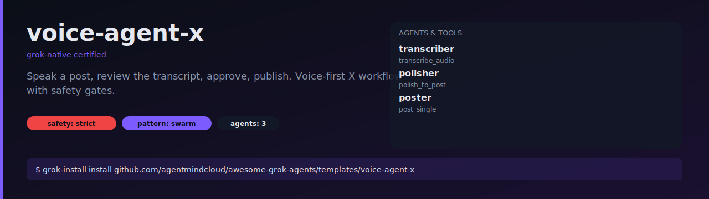

# voice-agent-x

Speak a thought. See it transcribed and polished into a clean X post.
Approve. Publish. The whole loop in under a minute.



## What it does

1. `transcriber` converts your audio file to text (no edits).
2. `polisher` picks the one idea worth keeping, fixes speech-to-text
   artefacts, and trims to 280 chars. Never invents facts.
3. The polished post lands in your approval queue.
4. `poster` publishes only approved text.

## Install

```bash
grok-install install github.com/agentmindcloud/awesome-grok-agents/templates/voice-agent-x
```

## Configure

```bash
cp .env.example .env
mkdir -p audio_in/
```

## Run

```bash
grok-install run --input audio_path=audio_in/monday-thought.m4a
```

Max audio file size is 25MB. For longer recordings, split first.

## Safety

- `safety_profile: strict`
- Filesystem read is scoped to `audio_in/`
- `post_single` gated behind approval
- Max 10 posts/hour
- Kill switch: `VOICE_X_DISABLED=1`
